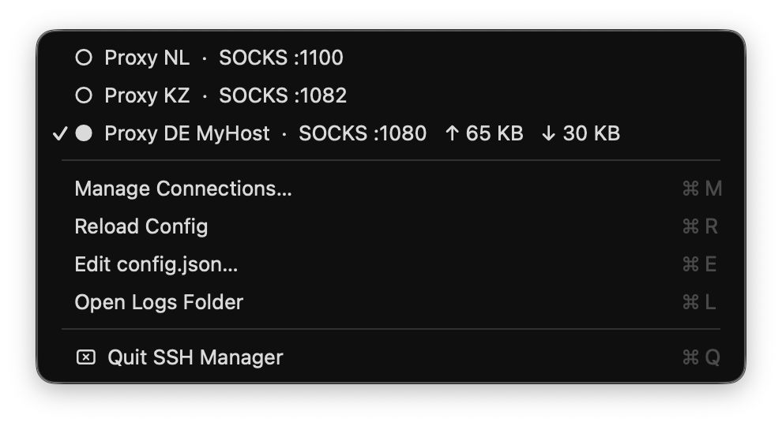
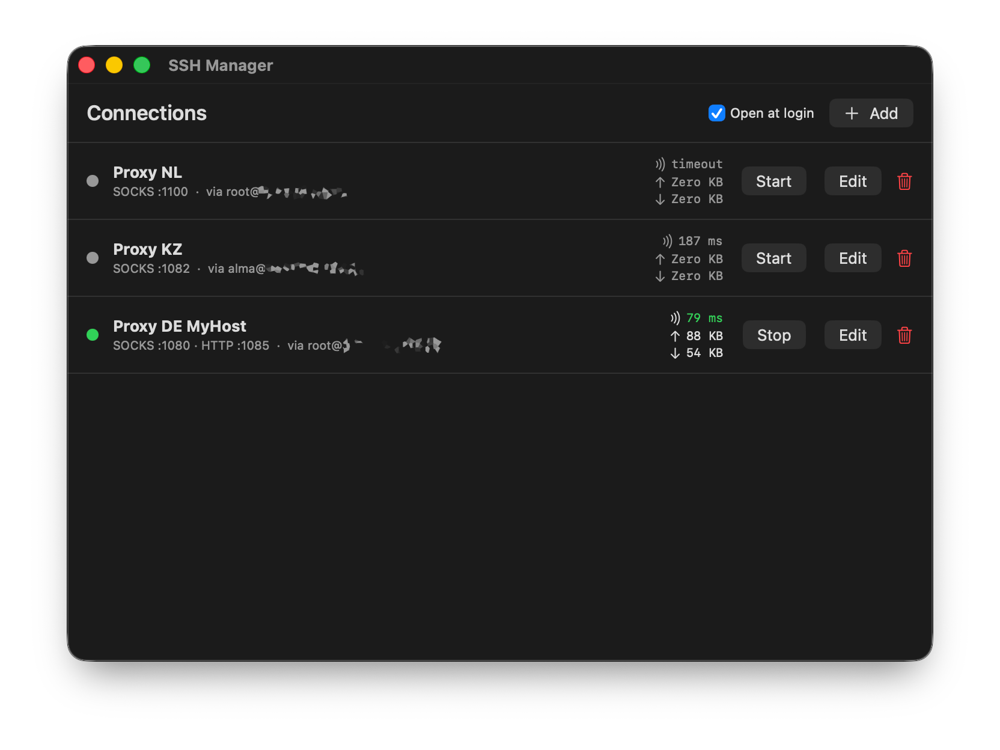
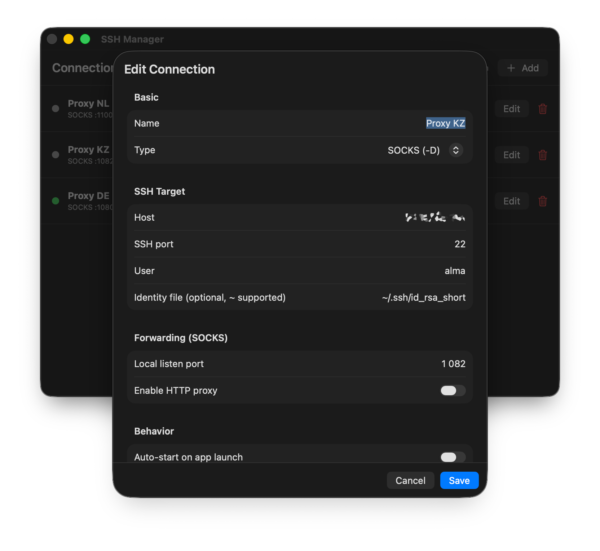
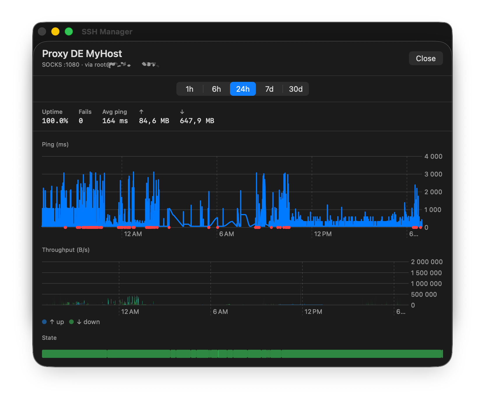

# SSH Manager

Менеджер SSH-туннелей для macOS, живущий в строке меню. Поднимает и держит туннели `-D` (SOCKS), `-L` (локальный форвард) и `-R` (обратный форвард), переподключается при обрывах, считает трафик и пинг, хранит историю и рисует по ней графики.

<p align="center">
  
</p>

<p align="center"><em>Меню в строке состояния: список туннелей со статусом (○ — остановлен, ● — работает) и счётчиками трафика. Активный туннель отмечен галочкой; клик по строке запускает или останавливает его.</em></p>

## Возможности

- **Три типа туннелей:** SOCKS-прокси (`-D`), проброс локального порта на удалённый сервис (`-L`), проброс локального сервиса наружу (`-R`).
- **Мастер-порт:** один фиксированный локальный порт (по умолчанию 1080), за которым одним кликом переключается любой SOCKS-туннель. Клиенты (браузер и т.п.) настраиваются на мастер-порт один раз, а сервер за ним меняется из меню; свой порт у каждого туннеля при этом сохраняется.
- **Авто-переподключение** с нарастающей паузой (2, 5, 10, 20, 30, 60 секунд), до 20 попыток. Кнопка «Retry now» пропускает ожидание.
- **Счётчики трафика** по каждому туннелю. Встроенный TCP-прокси считает байты в обе стороны (сам ssh этих цифр не даёт).
- **Мониторинг задержки:** TCP-проба до ssh-порта раз в 10 секунд. ICMP не нужен — бастионы часто режут пинг, но пускают SSH.
- **История и графики:** задержка, пропускная способность, аптайм и список событий за период от часа до 30 дней (SQLite).
- **HTTP-прокси** поверх SOCKS-туннеля: метод `CONNECT` для приложений, которые не умеют SOCKS.
- **Запуск при входе** через `SMAppService`.
- **Авто-старт** выбранных туннелей при запуске приложения.
- **Редактор соединений** в окне плюс правка `config.json` вручную с перечитыванием по кнопке.
- **Debug-режим:** трассировка пути трафика (accept'ы прокси, чанки байтов, публикация счётчиков) в отдельные trace-логи и «Save Debug Report…» — выгрузка всего внутреннего состояния одним текстовым файлом (состояния движков, счётчики, `lsof` по портам, хвосты логов) для диагностики.

## Скриншоты

<p align="center">
  
</p>

<p align="center"><em>Окно управления: по каждому туннелю видно тип и порт, цель подключения, пинг и трафик ↑/↓. Зелёная точка — туннель работает, серая — остановлен; справа кнопки Start/Stop, Edit и удаление. У «Proxy NL» проба не прошла (timeout), у работающего «Proxy DE MyHost» поднят ещё и HTTP-прокси на :1085.</em></p>

<p align="center">
  
</p>

<p align="center"><em>Редактор соединения: имя и тип туннеля, параметры SSH-цели (хост, порт, пользователь, ключ), локальный порт и тумблер HTTP-прокси для SOCKS, плюс поведение (авто-старт, авто-переподключение) и дополнительные опции ssh.</em></p>

<p align="center">
  
</p>

<p align="center"><em>Статистика за выбранный период: сводка (аптайм, число падений, средний пинг, суммарный трафик), график задержки с отметками неудачных проб, график пропускной способности и полоса состояния (зелёный — работал, красный — упал).</em></p>

## Установка

### Из готового пакета

Скачайте `SSHManager-<версия>.pkg` из раздела [Releases](https://github.com/boombick/ssh-manager/releases) и установите.

Пакет и приложение подписаны ad-hoc (без Apple Developer ID), поэтому Gatekeeper не даст открыть их двойным кликом. Один раз обойдите это так:

1. Правый клик по `.pkg` → **Open**, подтвердите. Это установит приложение в `/Applications`.
2. Правый клик по `/Applications/SSHManager.app` → **Open**.

Или одной командой в терминале после установки:

```sh
xattr -dr com.apple.quarantine /Applications/SSHManager.app
open /Applications/SSHManager.app
```

### Сборка из исходников

Нужен Swift 6.0+ (входит в Xcode или Command Line Tools). Внешних зависимостей нет.

```sh
./scripts/build-app.sh     # соберёт ./SSHManager.app
open ./SSHManager.app
```

Собрать установочный пакет:

```sh
./scripts/build-pkg.sh     # соберёт SSHManager-<версия>.pkg
```

## Настройка

При первом запуске создаётся пустой конфиг:

    ~/Library/Application Support/SSHManager/config.json

Добавляйте соединения через окно (**Manage Connections…**) или правьте файл руками (**Edit config.json…**), затем нажмите **Reload Config**.

### Мастер-порт

Один фиксированный локальный порт, за которым живёт «текущий» SOCKS-туннель. Настройте браузер или систему на `127.0.0.1:1080` один раз — и меняйте сервер за этим портом одним кликом:

- в статус-меню: подменю **Master Port :1080 → …** (список SOCKS-туннелей + Off);
- в окне управления: панель **Master port** — там же меняется и сам порт.

При переключении старые соединения через мастер-порт разрываются (трафик сразу идёт через новый сервер), а выбранный туннель поднимается автоматически, если был остановлен. Выбор сохраняется между перезапусками. Порт не должен совпадать с `listenPort` какого-либо соединения.

### Пример config.json

```json
{
  "masterPort": 1080,
  "masterConnectionId": "11111111-1111-1111-1111-111111111111",
  "connections": [
    {
      "id": "11111111-1111-1111-1111-111111111111",
      "name": "Work SOCKS",
      "type": "dynamic",
      "host": "bastion.example.com",
      "sshPort": 22,
      "user": "root",
      "identityFile": "~/.ssh/id_ed25519",
      "listenPort": 2080,
      "autoReconnect": true,
      "autoStart": true,
      "extraOptions": []
    },
    {
      "id": "22222222-2222-2222-2222-222222222222",
      "name": "Postgres on prod",
      "type": "local",
      "host": "bastion.example.com",
      "sshPort": 22,
      "user": "ops",
      "listenPort": 5433,
      "remoteHost": "db-prod.internal",
      "remotePort": 5432,
      "autoReconnect": true,
      "autoStart": false,
      "extraOptions": ["Compression=yes"]
    },
    {
      "id": "33333333-3333-3333-3333-333333333333",
      "name": "Expose local dev",
      "type": "remote",
      "host": "tunnel.example.com",
      "sshPort": 22,
      "user": "me",
      "listenPort": 8080,
      "remoteHost": "localhost",
      "remotePort": 3000,
      "autoReconnect": false,
      "autoStart": false,
      "extraOptions": []
    }
  ]
}
```

Конфиг от версий до 0.5.0 (голый массив соединений) мигрирует автоматически при первом запуске.

### Поля

Верхний уровень:

| Поле | Обязательное | Описание |
|---|---|---|
| `masterPort` | нет | Мастер-порт, по умолчанию 1080 |
| `masterConnectionId` | нет | `id` SOCKS-соединения за мастер-портом; `null` — выключен |
| `connections` | да | Список соединений (поля ниже) |

Соединение:

| Поле | Обязательное | Описание |
|---|---|---|
| `id` | да | Любой UUID. Стабильный ключ и имя файла лога |
| `name` | да | Имя в меню |
| `type` | да | `dynamic`, `local` или `remote` |
| `host` | да | Хост SSH-сервера |
| `sshPort` | да | Обычно 22 |
| `user` | да | Пользователь SSH |
| `identityFile` | нет | Путь к ключу, `~/` раскрывается. Без него работает обычный поиск ключей ssh и ssh-agent |
| `listenPort` | да | Локальный порт (для `-R` — порт на удалённой стороне) |
| `remoteHost` | для `-L`, `-R` | Целевой хост со стороны сервера (для `-R` — со стороны клиента) |
| `remotePort` | для `-L`, `-R` | Целевой порт |
| `autoReconnect` | да | Переподключение с паузой 2–60 с, до 20 попыток |
| `autoStart` | да | Запускать туннель при старте приложения |
| `extraOptions` | да | Дополнительные `ssh -o`, например `"TCPKeepAlive=yes"` (без ведущего `-o`) |
| `httpProxyEnabled` | нет | Только для `dynamic`: поднять HTTP CONNECT-прокси рядом с SOCKS |
| `httpProxyPort` | нет | Порт HTTP-прокси. Пусто — подбирается автоматически от `listenPort + 1` |

## Аутентификация

Приложение запускает `/usr/bin/ssh` с `BatchMode=yes` — паролей оно не спрашивает, аутентификация должна проходить без интерактива:

- ключи `~/.ssh/id_*` или явный `identityFile`;
- ключи в `ssh-agent` (агент наследуется при запуске).

Если туннель падает сразу после старта, откройте папку логов из меню (**Open Logs Folder**) и посмотрите `<id-соединения>.log`.

## Как это устроено

На каждый туннель приложение запускает `/usr/bin/ssh` и поднимает рядом маленький TCP-прокси. Пользовательский порт слушает прокси, а ssh переносится на тот же порт со сдвигом `+10000` на loopback. Так приложение видит объём трафика, который сам ssh не сообщает.

Пример команды для SOCKS-туннеля:

```
/usr/bin/ssh -N -T \
  -o BatchMode=yes \
  -o ServerAliveInterval=15 \
  -o ServerAliveCountMax=3 \
  -o ExitOnForwardFailure=yes \
  -D 11080 \
  -i ~/.ssh/id_ed25519 -o IdentitiesOnly=yes \
  -p 22 \
  root@bastion.example.com
```

Зелёный кружок — туннель работает, жёлтый — переподключение, красный — ошибка. Если ssh умирает (таймаут, обрыв сети, отказ аутентификации) и включён `autoReconnect`, приложение повторяет попытки по нарастающему расписанию; иначе помечает соединение как упавшее.

Прокси-слушатели привязаны только к `127.0.0.1`, наружу в локальную сеть они не открыты.

## Файлы

```
~/Library/Application Support/SSHManager/
  config.json                       ← настройки и соединения (правится вами или через UI)
  history.db                        ← история задержки/трафика/событий (SQLite)
  logs/<id-соединения>.log          ← stderr ssh по каждому запуску
  logs/<id-соединения>.trace.log    ← трассировка трафика (только при включённом Debug Mode)
  debug-reports/                    ← отчёты «Save Debug Report…»
```

## Структура проекта

```
Package.swift
Resources/              Info.plist, AppIcon.icns
scripts/                build-app.sh, build-pkg.sh, make-icon.sh (иконка из app_icon.png)
Sources/SSHManager/
  main.swift
  AppDelegate.swift
  Models/               Connection, AppConfig
  Storage/              Paths, ConfigStore, LoginItem
  Tunnel/               TunnelEngine, TunnelSupervisor, ProxyServer, HttpProxyServer, PingMonitor, DebugTrace
  History/              Database, HistoryStore
  Debug/                DebugReport
  UI/                   MenuBarController, MainWindowController, ConnectionListView, ConnectionEditView, StatsView
Tests/SSHManagerTests/
```
